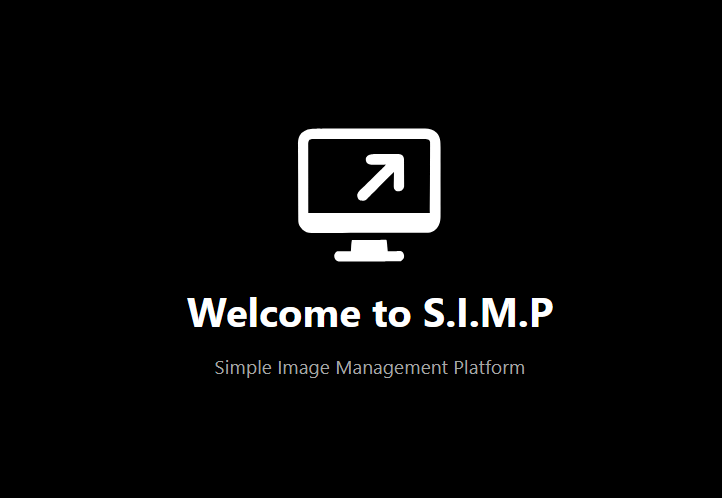

# SIMP - Simple Image Management Platform

A modern, secure, and feature-rich image hosting platform built with Go and React.

[Documentation](https://usesimp.app/docs) | [Live Demo](https://demo.usesimp.app/admin)

## Features

- 🔒 Secure authentication with JWT and CSRF protection
- 📊 Detailed analytics and view tracking
- 🌍 Geographic view statistics
- 🔐 Public/private image support
- 📱 Modern, responsive UI
- 📈 Storage usage monitoring
- 🚀 Fast and efficient image serving

## Contributing

Contributions are welcome! Please feel free to submit a Pull Request.

## License

This project is licensed under the AGPLv3 License - see the [LICENSE](LICENSE) file for details.
